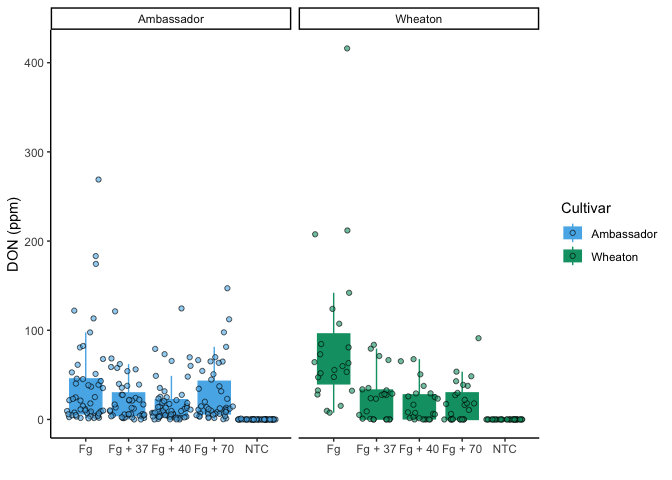
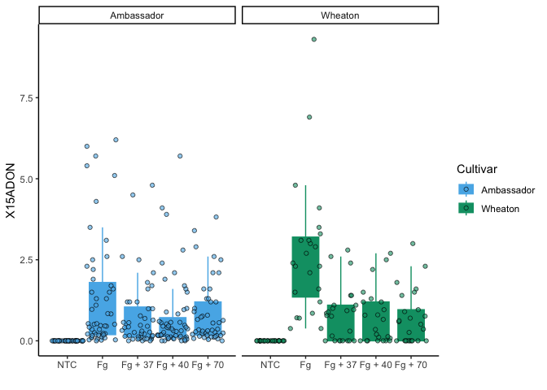
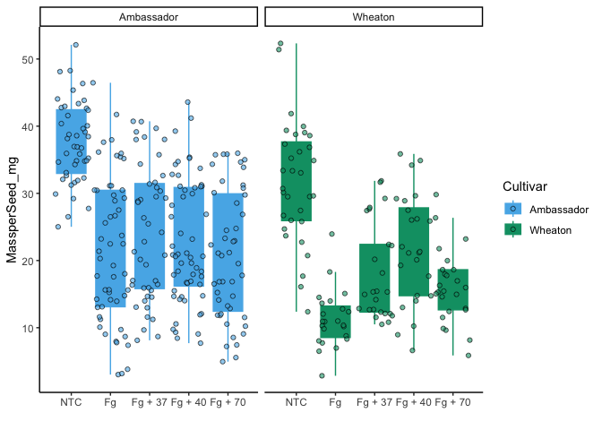
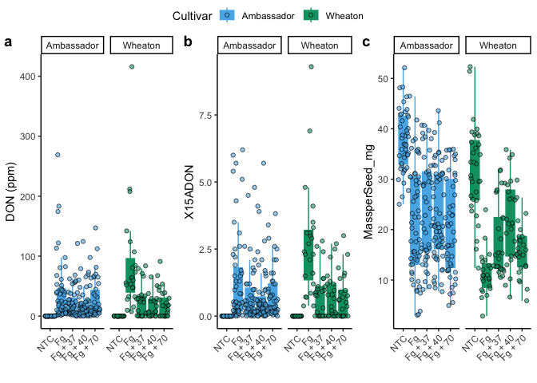
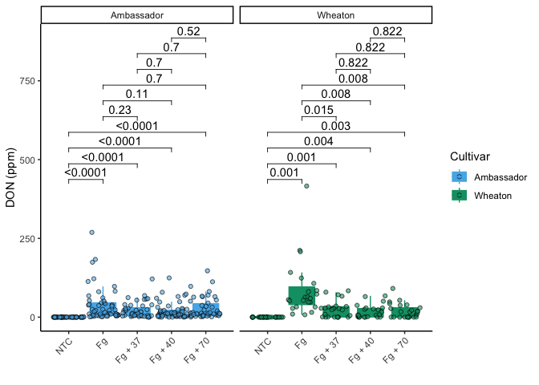
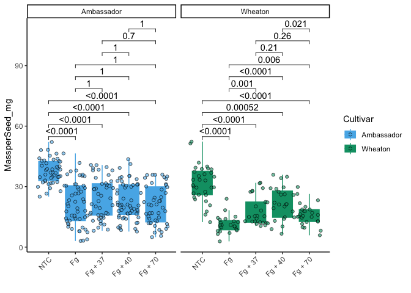
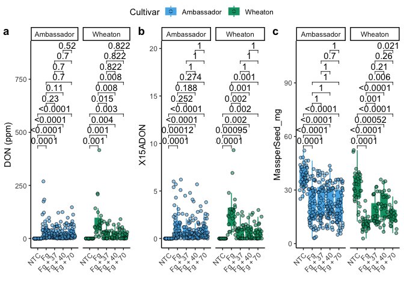

This is an example of R code.

``` r
# this is R code
summary(mtcars)
```

    ##       mpg             cyl             disp             hp       
    ##  Min.   :10.40   Min.   :4.000   Min.   : 71.1   Min.   : 52.0  
    ##  1st Qu.:15.43   1st Qu.:4.000   1st Qu.:120.8   1st Qu.: 96.5  
    ##  Median :19.20   Median :6.000   Median :196.3   Median :123.0  
    ##  Mean   :20.09   Mean   :6.188   Mean   :230.7   Mean   :146.7  
    ##  3rd Qu.:22.80   3rd Qu.:8.000   3rd Qu.:326.0   3rd Qu.:180.0  
    ##  Max.   :33.90   Max.   :8.000   Max.   :472.0   Max.   :335.0  
    ##       drat             wt             qsec             vs        
    ##  Min.   :2.760   Min.   :1.513   Min.   :14.50   Min.   :0.0000  
    ##  1st Qu.:3.080   1st Qu.:2.581   1st Qu.:16.89   1st Qu.:0.0000  
    ##  Median :3.695   Median :3.325   Median :17.71   Median :0.0000  
    ##  Mean   :3.597   Mean   :3.217   Mean   :17.85   Mean   :0.4375  
    ##  3rd Qu.:3.920   3rd Qu.:3.610   3rd Qu.:18.90   3rd Qu.:1.0000  
    ##  Max.   :4.930   Max.   :5.424   Max.   :22.90   Max.   :1.0000  
    ##        am              gear            carb      
    ##  Min.   :0.0000   Min.   :3.000   Min.   :1.000  
    ##  1st Qu.:0.0000   1st Qu.:3.000   1st Qu.:2.000  
    ##  Median :0.0000   Median :4.000   Median :2.000  
    ##  Mean   :0.4062   Mean   :3.688   Mean   :2.812  
    ##  3rd Qu.:1.0000   3rd Qu.:4.000   3rd Qu.:4.000  
    ##  Max.   :1.0000   Max.   :5.000   Max.   :8.000

This is how to include figures

``` r
data("mtcars")
library(ggplot2)
ggplot(mtcars, aes(x = wt, y = mpg)) +
  geom_smooth(method = lm, se = FALSE) +
  geom_point(aes(color = wt)) +
  xlab("Weight") +
  ylab("Miles Per Gallon") +
  scale_color_gradient(low = "dodgerblue", high = "black")
```

    ## `geom_smooth()` using formula = 'y ~ x'

<!-- -->

R Markdown formatting options

# First level header

*this text is italics* **this text is italics and bold**

## Links

[Link to my
github](https://github.com/alexberry8/In-Class-Coding-Challenges.git)

## Images

<figure>

<figcaption aria-hidden="true">Shrek ggplot</figcaption>
</figure>

## Formatted tables

``` r
library(knitr)
kable(mtcars, digits = 3, format = "markdown")
```

|                     |  mpg | cyl |  disp |  hp | drat |    wt |  qsec |  vs |  am | gear | carb |
|:--------------------|-----:|----:|------:|----:|-----:|------:|------:|----:|----:|-----:|-----:|
| Mazda RX4           | 21.0 |   6 | 160.0 | 110 | 3.90 | 2.620 | 16.46 |   0 |   1 |    4 |    4 |
| Mazda RX4 Wag       | 21.0 |   6 | 160.0 | 110 | 3.90 | 2.875 | 17.02 |   0 |   1 |    4 |    4 |
| Datsun 710          | 22.8 |   4 | 108.0 |  93 | 3.85 | 2.320 | 18.61 |   1 |   1 |    4 |    1 |
| Hornet 4 Drive      | 21.4 |   6 | 258.0 | 110 | 3.08 | 3.215 | 19.44 |   1 |   0 |    3 |    1 |
| Hornet Sportabout   | 18.7 |   8 | 360.0 | 175 | 3.15 | 3.440 | 17.02 |   0 |   0 |    3 |    2 |
| Valiant             | 18.1 |   6 | 225.0 | 105 | 2.76 | 3.460 | 20.22 |   1 |   0 |    3 |    1 |
| Duster 360          | 14.3 |   8 | 360.0 | 245 | 3.21 | 3.570 | 15.84 |   0 |   0 |    3 |    4 |
| Merc 240D           | 24.4 |   4 | 146.7 |  62 | 3.69 | 3.190 | 20.00 |   1 |   0 |    4 |    2 |
| Merc 230            | 22.8 |   4 | 140.8 |  95 | 3.92 | 3.150 | 22.90 |   1 |   0 |    4 |    2 |
| Merc 280            | 19.2 |   6 | 167.6 | 123 | 3.92 | 3.440 | 18.30 |   1 |   0 |    4 |    4 |
| Merc 280C           | 17.8 |   6 | 167.6 | 123 | 3.92 | 3.440 | 18.90 |   1 |   0 |    4 |    4 |
| Merc 450SE          | 16.4 |   8 | 275.8 | 180 | 3.07 | 4.070 | 17.40 |   0 |   0 |    3 |    3 |
| Merc 450SL          | 17.3 |   8 | 275.8 | 180 | 3.07 | 3.730 | 17.60 |   0 |   0 |    3 |    3 |
| Merc 450SLC         | 15.2 |   8 | 275.8 | 180 | 3.07 | 3.780 | 18.00 |   0 |   0 |    3 |    3 |
| Cadillac Fleetwood  | 10.4 |   8 | 472.0 | 205 | 2.93 | 5.250 | 17.98 |   0 |   0 |    3 |    4 |
| Lincoln Continental | 10.4 |   8 | 460.0 | 215 | 3.00 | 5.424 | 17.82 |   0 |   0 |    3 |    4 |
| Chrysler Imperial   | 14.7 |   8 | 440.0 | 230 | 3.23 | 5.345 | 17.42 |   0 |   0 |    3 |    4 |
| Fiat 128            | 32.4 |   4 |  78.7 |  66 | 4.08 | 2.200 | 19.47 |   1 |   1 |    4 |    1 |
| Honda Civic         | 30.4 |   4 |  75.7 |  52 | 4.93 | 1.615 | 18.52 |   1 |   1 |    4 |    2 |
| Toyota Corolla      | 33.9 |   4 |  71.1 |  65 | 4.22 | 1.835 | 19.90 |   1 |   1 |    4 |    1 |
| Toyota Corona       | 21.5 |   4 | 120.1 |  97 | 3.70 | 2.465 | 20.01 |   1 |   0 |    3 |    1 |
| Dodge Challenger    | 15.5 |   8 | 318.0 | 150 | 2.76 | 3.520 | 16.87 |   0 |   0 |    3 |    2 |
| AMC Javelin         | 15.2 |   8 | 304.0 | 150 | 3.15 | 3.435 | 17.30 |   0 |   0 |    3 |    2 |
| Camaro Z28          | 13.3 |   8 | 350.0 | 245 | 3.73 | 3.840 | 15.41 |   0 |   0 |    3 |    4 |
| Pontiac Firebird    | 19.2 |   8 | 400.0 | 175 | 3.08 | 3.845 | 17.05 |   0 |   0 |    3 |    2 |
| Fiat X1-9           | 27.3 |   4 |  79.0 |  66 | 4.08 | 1.935 | 18.90 |   1 |   1 |    4 |    1 |
| Porsche 914-2       | 26.0 |   4 | 120.3 |  91 | 4.43 | 2.140 | 16.70 |   0 |   1 |    5 |    2 |
| Lotus Europa        | 30.4 |   4 |  95.1 | 113 | 3.77 | 1.513 | 16.90 |   1 |   1 |    5 |    2 |
| Ford Pantera L      | 15.8 |   8 | 351.0 | 264 | 4.22 | 3.170 | 14.50 |   0 |   1 |    5 |    4 |
| Ferrari Dino        | 19.7 |   6 | 145.0 | 175 | 3.62 | 2.770 | 15.50 |   0 |   1 |    5 |    6 |
| Maserati Bora       | 15.0 |   8 | 301.0 | 335 | 3.54 | 3.570 | 14.60 |   0 |   1 |    5 |    8 |
| Volvo 142E          | 21.4 |   4 | 121.0 | 109 | 4.11 | 2.780 | 18.60 |   1 |   1 |    4 |    2 |

## Links to analysis

- [Link to Markdown Tutorial](MarkdownTutorial.md)

# DOI

[](https://doi.org/10.5281/zenodo.14933489)

[Link to Mycotoxin Graph](https://doi.org/10.1094/PDIS-06-21-1253-RE)

``` r
mycotoxin <- read.csv("MycotoxinData.csv", na.strings="na")
cbbPalette <- c("#000000", "#E69F00", "#56B4E9", "#009E73", "#F0E442", "#0072B2", "#D55E00", "#CC79A7")
library(ggplot2)
library(ggpubr)

### Question 1 - Create a Box Plot
boxplot <- ggplot(mycotoxin, aes(x = Treatment, y = DON, fill = Cultivar, color = Cultivar)) +
  geom_boxplot(outlier.shape = NA, position = position_dodge()) +  
  geom_point(position = position_jitterdodge(0.9), alpha = 0.6, shape = 21, color = "black") +
  scale_fill_manual(values = c("Ambassador" = "#56B4E9", "Wheaton" = "#009E73")) + 
  scale_color_manual(values = c("Ambassador" = "#56B4E9", "Wheaton" = "#009E73")) +
  labs(y = "DON (ppm)", x = "") +  
  theme_classic() +  
  facet_wrap(~Cultivar) 
boxplot
```

    ## Warning: Removed 8 rows containing non-finite outside the scale range
    ## (`stat_boxplot()`).

    ## Warning: Removed 8 rows containing missing values or values outside the scale range
    ## (`geom_point()`).

<!-- -->

``` r
### Question 2 - Reorder Treatment Levels
mycotoxin$Treatment <- factor(mycotoxin$Treatment, levels = c("NTC", "Fg", "Fg + 37", "Fg + 40", "Fg + 70"))
boxplot1 <- ggplot(mycotoxin, aes(x = Treatment, y = DON, fill = Cultivar, color = Cultivar)) +
  geom_boxplot(outlier.shape = NA, position = position_dodge()) +  
  geom_point(position = position_jitterdodge(0.9), alpha = 0.6, shape = 21, color = "black") +
  scale_fill_manual(values = c("Ambassador" = "#56B4E9", "Wheaton" = "#009E73")) + 
  scale_color_manual(values = c("Ambassador" = "#56B4E9", "Wheaton" = "#009E73")) +
  labs(y = "DON (ppm)", x = "") +  
  theme_classic() +  
  facet_wrap(~Cultivar) 
boxplot1
```

    ## Warning: Removed 8 rows containing non-finite outside the scale range
    ## (`stat_boxplot()`).
    ## Removed 8 rows containing missing values or values outside the scale range
    ## (`geom_point()`).

<!-- -->

``` r
### Question 3 - X15ADON and MassperSeed_mg Plots
# X15ADON Plot
boxplot2 <- ggplot(mycotoxin, aes(x = Treatment, y = X15ADON, fill = Cultivar, color = Cultivar)) +
  geom_boxplot(outlier.shape = NA, position = position_dodge()) +  
  geom_point(position = position_jitterdodge(0.9), alpha = 0.6, shape = 21, color = "black") +
  scale_fill_manual(values = c("Ambassador" = "#56B4E9", "Wheaton" = "#009E73")) + 
  scale_color_manual(values = c("Ambassador" = "#56B4E9", "Wheaton" = "#009E73")) +
  labs(y = "X15ADON", x = "") +  
  theme_classic() +  
  facet_wrap(~Cultivar) 
boxplot2
```

    ## Warning: Removed 10 rows containing non-finite outside the scale range
    ## (`stat_boxplot()`).

    ## Warning: Removed 10 rows containing missing values or values outside the scale range
    ## (`geom_point()`).

<!-- -->

``` r
# MassperSeed_mg Plot
boxplot3 <- ggplot(mycotoxin, aes(x = Treatment, y = MassperSeed_mg, fill = Cultivar, color = Cultivar)) +
  geom_boxplot(outlier.shape = NA, position = position_dodge()) +  
  geom_point(position = position_jitterdodge(0.9), alpha = 0.6, shape = 21, color = "black") +
  scale_fill_manual(values = c("Ambassador" = "#56B4E9", "Wheaton" = "#009E73")) + 
  scale_color_manual(values = c("Ambassador" = "#56B4E9", "Wheaton" = "#009E73")) +
  labs(y = "MassperSeed_mg", x = "") +  
  theme_classic() +  
  facet_wrap(~Cultivar) 
boxplot3
```

    ## Warning: Removed 2 rows containing non-finite outside the scale range
    ## (`stat_boxplot()`).

    ## Warning: Removed 2 rows containing missing values or values outside the scale range
    ## (`geom_point()`).

<!-- -->

``` r
### Question 4 - Combine all Three Plots
boxplot1 <- boxplot1 + theme(axis.text.x = element_text(angle = 45, hjust = 1))
boxplot2 <- boxplot2 + theme(axis.text.x = element_text(angle = 45, hjust = 1))
boxplot3 <- boxplot3 + theme(axis.text.x = element_text(angle = 45, hjust = 1))
combinedplot <- ggarrange(boxplot1, boxplot2, boxplot3, labels = "auto", nrow = 1, ncol = 3, common.legend = T)
```

    ## Warning: Removed 8 rows containing non-finite outside the scale range
    ## (`stat_boxplot()`).

    ## Warning: Removed 8 rows containing missing values or values outside the scale range
    ## (`geom_point()`).

    ## Warning: Removed 8 rows containing non-finite outside the scale range
    ## (`stat_boxplot()`).

    ## Warning: Removed 8 rows containing missing values or values outside the scale range
    ## (`geom_point()`).

    ## Warning: Removed 10 rows containing non-finite outside the scale range
    ## (`stat_boxplot()`).

    ## Warning: Removed 10 rows containing missing values or values outside the scale range
    ## (`geom_point()`).

    ## Warning: Removed 2 rows containing non-finite outside the scale range
    ## (`stat_boxplot()`).

    ## Warning: Removed 2 rows containing missing values or values outside the scale range
    ## (`geom_point()`).

``` r
combinedplot
```

<!-- -->

``` r
### Question 5 - Add T-Test and Rearrange all Three Plots
# boxplot1
boxplot1_ttest <- boxplot1 + 
  geom_pwc(aes(group = Treatment), method = "t.test", label = "p.adj.format")
boxplot1_ttest
```

    ## Warning: Removed 8 rows containing non-finite outside the scale range
    ## (`stat_boxplot()`).

    ## Warning: Removed 8 rows containing non-finite outside the scale range
    ## (`stat_pwc()`).

    ## Warning: Removed 8 rows containing missing values or values outside the scale range
    ## (`geom_point()`).

<!-- -->

``` r
# boxplot2
boxplot2_ttest <- boxplot2 + 
  geom_pwc(aes(group = Treatment), method = "t.test", label = "p.adj.format")
boxplot2_ttest
```

    ## Warning: Removed 10 rows containing non-finite outside the scale range
    ## (`stat_boxplot()`).

    ## Warning: Removed 10 rows containing non-finite outside the scale range
    ## (`stat_pwc()`).

    ## Warning: Removed 10 rows containing missing values or values outside the scale range
    ## (`geom_point()`).

<!-- -->

``` r
# boxplot3
boxplot3_ttest <- boxplot3 + 
  geom_pwc(aes(group = Treatment), method = "t.test", label = "p.adj.format")
boxplot3_ttest
```

    ## Warning: Removed 2 rows containing non-finite outside the scale range
    ## (`stat_boxplot()`).

    ## Warning: Removed 2 rows containing non-finite outside the scale range
    ## (`stat_pwc()`).

    ## Warning: Removed 2 rows containing missing values or values outside the scale range
    ## (`geom_point()`).

<!-- -->

``` r
# Combine all Three Plots with P-Values
combinedplot2 <- ggarrange(boxplot1_ttest, boxplot2_ttest, boxplot3_ttest, labels = "auto", nrow = 1, ncol = 3, common.legend = T)
```

    ## Warning: Removed 8 rows containing non-finite outside the scale range
    ## (`stat_boxplot()`).

    ## Warning: Removed 8 rows containing non-finite outside the scale range
    ## (`stat_pwc()`).

    ## Warning: Removed 8 rows containing missing values or values outside the scale range
    ## (`geom_point()`).

    ## Warning: Removed 8 rows containing non-finite outside the scale range
    ## (`stat_boxplot()`).

    ## Warning: Removed 8 rows containing non-finite outside the scale range
    ## (`stat_pwc()`).

    ## Warning: Removed 8 rows containing missing values or values outside the scale range
    ## (`geom_point()`).

    ## Warning: Removed 10 rows containing non-finite outside the scale range
    ## (`stat_boxplot()`).

    ## Warning: Removed 10 rows containing non-finite outside the scale range
    ## (`stat_pwc()`).

    ## Warning: Removed 10 rows containing missing values or values outside the scale range
    ## (`geom_point()`).

    ## Warning: Removed 2 rows containing non-finite outside the scale range
    ## (`stat_boxplot()`).

    ## Warning: Removed 2 rows containing non-finite outside the scale range
    ## (`stat_pwc()`).

    ## Warning: Removed 2 rows containing missing values or values outside the scale range
    ## (`geom_point()`).

``` r
combinedplot2
```

<!-- -->
