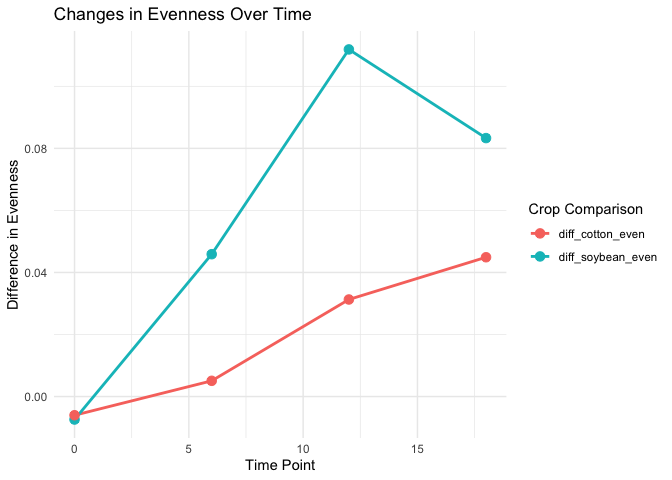

# Question 1

``` r
diversity.data <- read.csv("CodingChallenge5/DiversityData.csv", header = TRUE)
metadata <- read.csv("CodingChallenge5/Metadata.csv", header = TRUE)
```

# Question 2

``` r
library(tidyverse)
```

    ## ── Attaching core tidyverse packages ──────────────────────── tidyverse 2.0.0 ──
    ## ✔ dplyr     1.1.4     ✔ readr     2.1.5
    ## ✔ forcats   1.0.0     ✔ stringr   1.5.1
    ## ✔ ggplot2   3.5.1     ✔ tibble    3.2.1
    ## ✔ lubridate 1.9.4     ✔ tidyr     1.3.1
    ## ✔ purrr     1.0.2     
    ## ── Conflicts ────────────────────────────────────────── tidyverse_conflicts() ──
    ## ✖ dplyr::filter() masks stats::filter()
    ## ✖ dplyr::lag()    masks stats::lag()
    ## ℹ Use the conflicted package (<http://conflicted.r-lib.org/>) to force all conflicts to become errors

``` r
alpha <- left_join(metadata, diversity.data, by = "Code")
head(alpha)
```

    ##     Code Crop Time_Point Replicate Water_Imbibed  shannon invsimpson   simpson
    ## 1 S01_13 Soil          0         1            na 6.624921   210.7279 0.9952545
    ## 2 S02_16 Soil          0         2            na 6.612413   206.8666 0.9951660
    ## 3 S03_19 Soil          0         3            na 6.660853   213.0184 0.9953056
    ## 4 S04_22 Soil          0         4            na 6.660671   204.6908 0.9951146
    ## 5 S05_25 Soil          0         5            na 6.610965   200.2552 0.9950064
    ## 6 S06_28 Soil          0         6            na 6.650812   199.3211 0.9949830
    ##   richness
    ## 1     3319
    ## 2     3079
    ## 3     3935
    ## 4     3922
    ## 5     3196
    ## 6     3481

# Question 3

``` r
alpha_even <- alpha %>%
  mutate(Pielou_Evenness = shannon/log(richness))
head(alpha_even)
```

    ##     Code Crop Time_Point Replicate Water_Imbibed  shannon invsimpson   simpson
    ## 1 S01_13 Soil          0         1            na 6.624921   210.7279 0.9952545
    ## 2 S02_16 Soil          0         2            na 6.612413   206.8666 0.9951660
    ## 3 S03_19 Soil          0         3            na 6.660853   213.0184 0.9953056
    ## 4 S04_22 Soil          0         4            na 6.660671   204.6908 0.9951146
    ## 5 S05_25 Soil          0         5            na 6.610965   200.2552 0.9950064
    ## 6 S06_28 Soil          0         6            na 6.650812   199.3211 0.9949830
    ##   richness Pielou_Evenness
    ## 1     3319       0.8171431
    ## 2     3079       0.8232216
    ## 3     3935       0.8046776
    ## 4     3922       0.8049774
    ## 5     3196       0.8192376
    ## 6     3481       0.8155427

# Question 4

``` r
alpha_average <- alpha_even %>%
  group_by(Crop, Time_Point) %>%
  summarise(
    mean_evenness = mean(Pielou_Evenness, na.rm = TRUE),
    count = n(),
    sd_evenness = sd(Pielou_Evenness, na.rm = TRUE),
    se_evenness = sd_evenness / sqrt(count),
    .groups = "drop"
  )
```

# Question 5

``` r
alpha_average2 <- alpha_average %>%
  select(Time_Point, Crop, mean_evenness) %>%
  pivot_wider(names_from = Crop, values_from = mean_evenness) %>%
  mutate(
    diff_cotton_even = Soil - Cotton,
    diff_soybean_even = Soil - Soybean
  )
head(alpha_average2)
```

    ## # A tibble: 4 × 6
    ##   Time_Point Cotton  Soil Soybean diff_cotton_even diff_soybean_even
    ##        <int>  <dbl> <dbl>   <dbl>            <dbl>             <dbl>
    ## 1          0  0.820 0.814   0.822         -0.00602          -0.00740
    ## 2          6  0.805 0.810   0.764          0.00507           0.0459 
    ## 3         12  0.767 0.798   0.687          0.0313            0.112  
    ## 4         18  0.755 0.800   0.716          0.0449            0.0833

# Question 6

``` r
alpha_plot_data <- alpha_average2 %>%
  select(Time_Point, diff_soybean_even, diff_cotton_even) %>%
  pivot_longer(cols = c(diff_soybean_even, diff_cotton_even), names_to = "diff", values_to = "values")

ggplot(alpha_plot_data, aes(x = Time_Point, y = values, color = diff, group = diff)) +
  geom_line(size = 1) + 
  geom_point(size = 3) +
  labs(
    title = "Changes in Evenness Over Time",
    x = "Time Point",
    y = "Difference in Evenness",
    color = "Crop Comparison"
  ) +
  theme_minimal()
```

    ## Warning: Using `size` aesthetic for lines was deprecated in ggplot2 3.4.0.
    ## ℹ Please use `linewidth` instead.
    ## This warning is displayed once every 8 hours.
    ## Call `lifecycle::last_lifecycle_warnings()` to see where this warning was
    ## generated.

<!-- -->

# Question 7

[Link to
GitHub](https://github.com/alexberry8/In-Class-Coding-Challenges)
